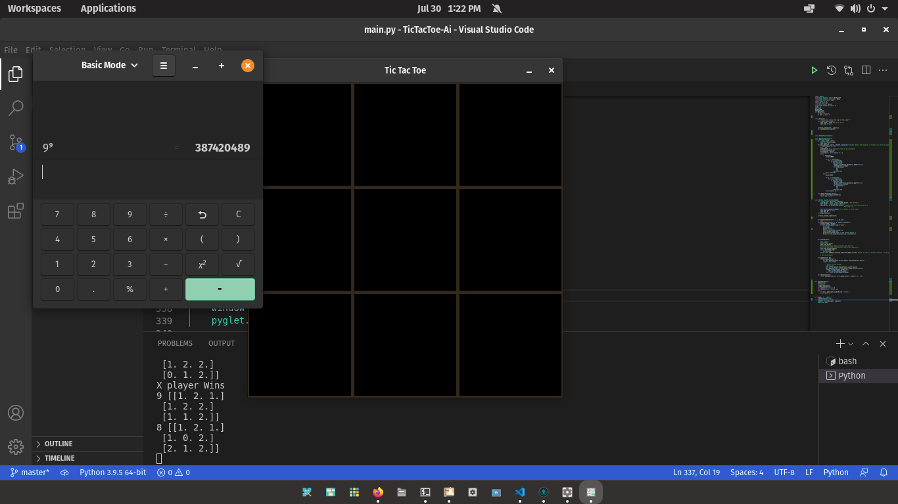

[![LinkedIn][linkedin-shield]][https://www.linkedin.com/in/wadhah-dahouathi/]


<!-- PROJECT LOGO -->
<br />
<p align="center">
  <a href="https://github.com/Dahouathi/TicTacToe-Ai">
    
  </a>

  <h3 align="center">TicTacToe AI</h3>

  <p align="center">
    Quick AI to solve 3x3 or 5x5 TicTacToe
    <br />
    <a href="https://github.com/Dahouathi/TicTacToe-Ai"><strong>Explore the docs »</strong></a>
    <br />
    <br />
    .
    <a href="https://github.com/Dahouathi/TicTacToe-Ai/issues">Report Bug</a>
    ·
    <a href="https://github.com/Dahouathi/TicTacToe-Ai/issues">Request Feature</a>
  </p>
</p>


<!-- TABLE OF CONTENTS -->
<details open="open">
  <summary>Table of Contents</summary>
  <ol>
    <li>
      <a href="#about-the-project">About The Project</a>
      <ul>
        <li><a href="#built-with">Built With</a></li>
      </ul>
    </li>
    <li>
      <a href="#getting-started">Getting Started</a>
      <ul>
        <li><a href="#prerequisites">Prerequisites</a></li>
        <li><a href="#installation">Installation</a></li>
      </ul>
    </li>
    <li><a href="#usage">Usage</a></li>
    <li><a href="#contributing">Contributing</a></li>
    <li><a href="#contact">Contact</a></li>
  </ol>
</details>


<!-- ABOUT THE PROJECT -->
## About The Project



playing tic tac toe as human isn't that much of challenge for most of us even if it's 5x5 tic tac toe.simply because we human can think and make decisions based on out intellegence without even realizing that we're doing so. 
Making an AI that is cable of doing that " the thinking and predicting part " is kind of hard.

Here's why:
* choosing the algorithm that we're going to use.
* For 3x3 TicTac Toe there is at least 9⁹ movement mossible that we can make and that's allot to go through it all nd if it's 5x5 the number of mouvements is so enormous .
* optimization, it's clear that out main problem here is optimizing the algos we're writing.


Of course, before creating the AI, we need to make the game. 
So to make the code readable I have created Seperate Players:
* Random player : choose its move randomly on the board 
* Human Player  : Play with The mouse 
* AI player     : the Machine Playing

After that, I am going to use the minimax algorithm.And save each move that is possible to play by the AI in a table "scores.db" so that The AI doesn't take so much time to calculate its next move.


A list of commonly used resources that I find helpful are listed in the acknowledgements.

### Built With

I am building this With python language so here's the packages I am using:
* [Pyglet](http://pyglet.org/)
* [Sqlite](https://www.sqlite.org/index.html)


<!-- GETTING STARTED -->
## Getting Started

this is the instructions to set up your project locally.
To get a local,follow these simple steps.


### Installation


1. Clone the repo
   ```sh
   git clone https://github.com/Dahouathi/TicTacToe-Ai
   ```
2. Install packages
   this how you can install the requirements:

  * Using pip 
    try this if you are on windows
    ```sh
    pip install pyglet pysqlite3
    ```
    if you are on linux try this :
    ```sh
    python3 -m pip install pyglet pysqlite3
    ```


<!-- USAGE EXAMPLES -->
## Usage

This project that I have Created Has a database that contains every possible board state of the TicTacToe Game and its score.
You can use that in your "tic-tac-toe" game or perhaps a connect4 game.
You can even make a connect4 game because it's the same tactics it's just a 7x7 board, so it needs more optimization.


<!-- CONTRIBUTING -->
## Contributing

Contributions are what make the open source community such an amazing place to be learn, inspire, and create. Any contributions you make are **greatly appreciated**.

1. Fork the Project
2. Create your Feature Branch (`git checkout -b feature/AmazingFeature`)
3. Commit your Changes (`git commit -m 'Add some AmazingFeature'`)
4. Push to the Branch (`git push origin feature/AmazingFeature`)
5. Open a Pull Request


<!-- CONTACT -->
## Contact

Your Name - [@dahouathi_w](https://twitter.com/dahouathi_w) - Mohamed-wadhah.dahouathi@ensta-paris.fr

[![LinkedIn][linkedin-shield]][https://www.linkedin.com/in/wadhah-dahouathi/]

Project Link: [https://github.com/Dahouathi/TicTacToe-Ai](https://github.com/Dahouathi/TicTacToe-Ai)


<!-- MARKDOWN LINKS & IMAGES -->
<!-- https://www.markdownguide.org/basic-syntax/#reference-style-links -->
[linkedin-shield]: https://img.shields.io/badge/-LinkedIn-black.svg?style=for-the-badge&logo=linkedin&colorB=555

